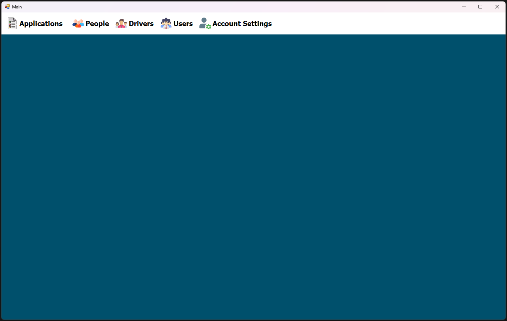
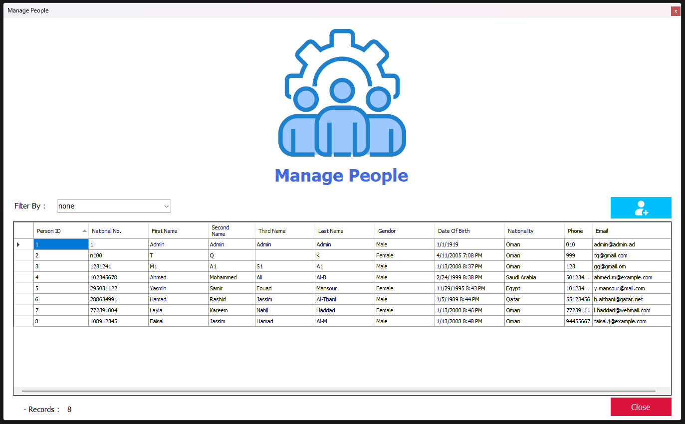
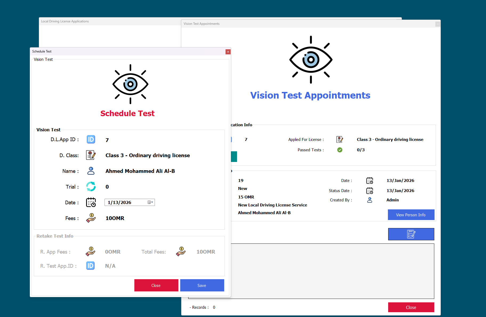
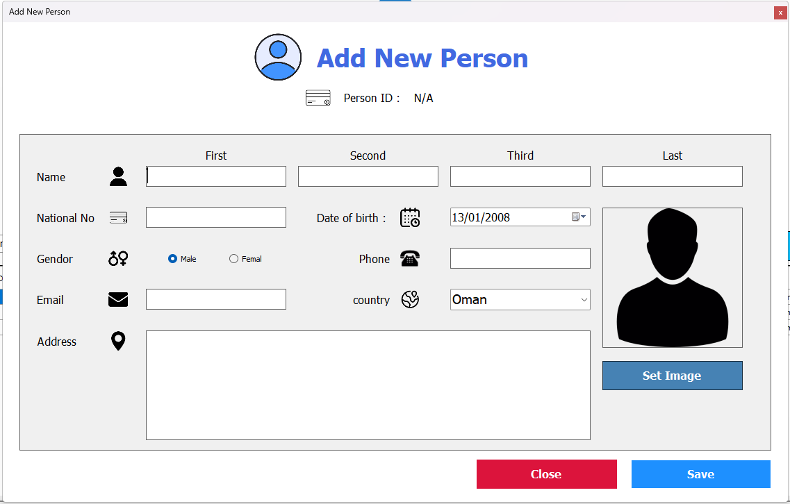

# Driving-Vehicle-License-Department-Application 🚗
This is a comprehensive Desktop Application built with **C#** and **SQL Server**. It manages the full lifecycle of driving licenses, from person registration and application handling to multi-stage testing and license issuance.

The project follows a professional **3-Tier Architecture** (Data Access Layer, Business Layer and Presentation Layer), ensuring clean code and scalable logic.
## ✨ Key Features
* **Person Management:** Full CRUD operations with image management and national ID validation.
* **User Management:** Role-based access with secure login.
* **Application Services:** Handling New, Renew, Replacement (Damaged/Lost), and Release of licenses.
* **Testing System:** Managing Vision, Theory, and Practical tests with appointment scheduling.
* **Licenses & International Permits:** Issuing local and international driving permits.
* **Detain/Release:** Tracking detained licenses and managing fine payments.

---

## 🖼 System Preview

*Figure 1: Main Application Dashboard*


*Figure 2: Reusable Person Card User Control*


*Figure 3: Driving Tests Management Interface*


*Figure 4: Comprehensive Tracking for Local License Applications.*


*Figure 5: Interface for adding and managing person records with real-time validation.*


*Figure 6: Comprehensive list and management of Local Driving License Applications.*


*Figure 7: Detailed view of person information utilizing reusable User Controls.*

---

## 🛠 Tech Stack
* **Language:** C# (Windows Forms)
* **Database:** Microsoft SQL Server
* **Architecture:** Layered (Data, Business, UI)
* **Tools:** Visual Studio, SQL Server Management Studio (SSMS)

---
## 🚀 Setup & Installation Guide

To get the project running on your PC, follow these steps:

### 1. Database Restoration
The database schema and data are provided as a `.bak` file.
1. Download the `myDatabase.bak` file from this repository.
2. Open **SQL Server Management Studio (SSMS)**.
3. Right-click on **Databases** > **Restore Database...**
4. Select **Device**, browse for the `.bak` file, and restore it. The database name should be `DVLD`.

### 2. Configuration (Connection String)
You must update the database connection settings to match your local server:
1. Open the solution in **Visual Studio**.
2. Locate the project `DVLD_Data_Layer`.
3. Open the file `clsDataAccessSettings.cs`.
4. Modify the `ConnectionString` variable with your server name and credentials:

```csharp
// Replace with your server name and credentials
public static string ConnectionString = "Server=.;Database=DVLD;User Id=YourUsername;Password=YourPassword;";
